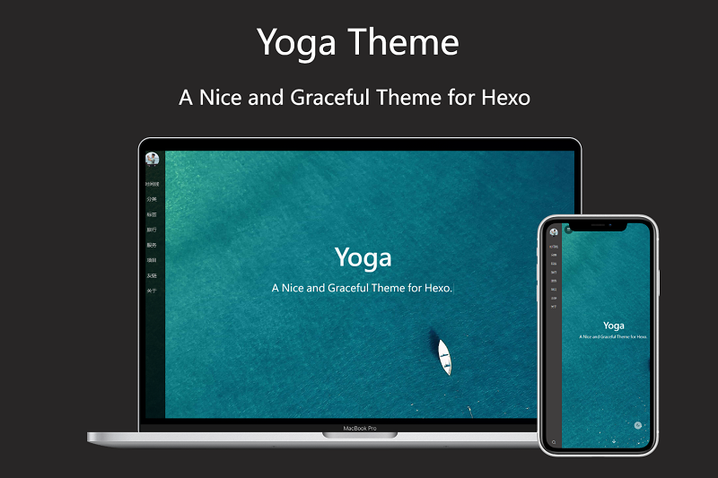

<p align="center"><a href="https://LeoHaoVIP.gitee.io" target="_blank" rel="noopener noreferrer"></a></p>

<h3 align="center">一个干净且优雅的 Hexo 主题</h3>

<p align="center">
  <a href="http://standardjs.com" target="_blank" rel="noopener noreferrer">
    
  </a>
  <br>  
  <a href="https://www.npmjs.com/package/hexo-theme-yoga" target="_blank" rel="noopener noreferrer">
  
  </a>
  <a href="https://LeoHaoVIP.gitee.io" target="_blank" rel="noopener noreferrer">
   
   </a>
  <br>
  <a href="https://www.npmjs.com/package/hexo-theme-yoga" target="_blank" rel="noopener noreferrer">
    
  </a> 
 
  <a href="https://github.com/LeoHaoVIP/hexo-theme-yoga/blob/master/LICENSE" target="_blank" rel="noopener noreferrer">
  </a>
</p>


---

预览（[LeoHao's Blog ](https://blog.leohao.cn) · [GitHub Pages ](https://leohaovip.github.io)） |[中文使用说明](https://blog.leohao.cn/2023/03/10/hexo-theme-yoga)  | [GitHub](https://github.com/LeoHaoVIP/hexo-theme-yoga) | [Gitee](https://gitee.com/LeoHaoVIP/hexo-theme-yoga)

🧘 Yoga is a nice and graceful theme for Hexo, also fast, powerful and responsive. It contains many awesome features, It's perfect for your blog, "Yoga" means "Peaceful", it also the name of a [singer](https://music.163.com/#/artist?id=3685) from Taiwan, China.

[Create an issue](https://github.com/LeoHaoVIP/hexo-theme-yoga/issues/new/choose) if you have any queries or advice during the process of using.



## Copyright Declaration

**The copyright of this project belongs entirely to [ShenYu](https://github.com/Shen-Yu)**, I come here to make the project better.

Hexo-theme-yoga is an optimized and customized version of [hexo-theme-ayer](https://github.com/Shen-Yu/hexo-theme-ayer), developed by [ShenYu](https://github.com/Shen-Yu). The main changes are as follows:

- Fix CDN accessing problems
- Add support for customized serverUrls for LeanCloud API
- Fix word count bugs on encrypted pages
- Fix ToC (Table of Contents) bugs on encrypted pages
- Add warning for old posts
- Add hidden property in the meta-data of post
- Make image_viewer only works for posts not pages

## Install

### For hexo >= 5.0

```shell
npm i hexo-theme-yoga -S
```

- If this theme is newly installed, a `_config.yoga.yml` file will be generated in the root directory after the installation is complete, and you can directly edit the `_config.yoga.yml` file for configuration.
- If it is a theme upgrade, you can use the configuration method of hexo < 5.0, or you can move the original configuration file to the root directory and rename it to `_config.yoga.yml`.

### For hexo < 5.0

```shell
git clone https://github.com/LeoHaoVIP/hexo-theme-yoga.git themes/yoga
```

## Enable

Modify `theme` setting in `_config.yml` to `yoga`

```yml
theme: yoga
```

## Update

```bash
cd themes/yoga
git pull
```

## Multi Language Support

zh-CN（中文简体） en（English） zh-TW（中文繁体） ja（日本語） es（Español） de（Deutsch） fr（Français） ru（Русский） ko（한국어） vi（Tiếng Việt） nl（Nederlands） no（norsk） pt（Português）

English is default languge, if you want to change, modify `language` option in `_config.yml` file in your Hexo blog's root folder.

## Configuration

let me know if you have any questions.

```yml
# Menu-Sidebar
menu:
  Home: /
  Timeline: /archives
  Categories: /categories
  Tags: /tags
  Travel: /categories/旅行/
  About: /about

# Subtitle and Typing animation
# https://github.com/mattboldt/typed.js
subtitle:
  enable: true
  text: Yoga
  text2: hexo-theme-yoga
  text3: A nice and graceful theme for hexo! #Supports up to three lines of text
  startDelay: 0
  typeSpeed: 150
  loop: true
  backSpeed: 50
  showCursor: true

# Favicon and sidebar logo
favicon: /favicon.ico
logo: /images/yoga.png

# Cover Setting
# enable: [true|false]；path: [background-image]；logo: [cover-logo-image]
cover:
  enable: true
  path: /images/cover4.jpg # there are some beautiful cover images in Yoga's directory: /source/images, choose your favorite image to replace it.
  logo: false #/images/yoga.png

# ProgressBar
progressBar: true

# Boardcast
broadcast:
  enable: true
  type: 2 # 1：custom，2：hitokoto api(https://hitokoto.cn/)
  text: a clean and elegant theme, fast and responsive. # only work in custom mode

# Article Setting
# (Use this to excerpt if article is too long：<!--more-->)
excerpt_link: Read More...
excerpt_all: false

# Copy code button
copy_btn: true
# Share
share_enable: false
# If you are not in China, maybe you prefer to set:false
share_china: true
# share text
share_text: Share
# search text
search_text: Search
# nav text
nav_text:
  page_prev: Prev page
  page_next: Next page
  post_prev: Newer posts
  post_next: Older posts

# Catalog in article
toc: true

# images in the article support click to fullscreen
image_viewer: true

# https://github.com/willin/hexo-wordcount
word_count:
  enable: true
  # only display in article page(not in index page)
  only_article_visit: false

# Reward Setting
# type：0-close reward； 1-only open in article which you have configured reward:true； 2-open in all articles
reward_type: 0
# reward word
reward_wording: "Buy me a cup of coffee~"
# qrcode image path
alipay: /images/alipay.jpg
# qrcode image path
weixin: /images/wechat.jpg

# Copyright
# type：0-close all； 1-only display in article which you have configured copyright: true； 2-all articles
copyright_type: 2

# Search
# https://github.com/theme-next/hexo-generator-searchdb
search: true

# RSS
# leave it empty if you dont' need
rss: /atom.xml

# DarkMode
darkmode: true

# Canvas background style: 0-close，1-moveline
canvas_bg: 0

# Custom mouse pointer，replace /images/mouse.cur
mouse:
  enable: false
  path: /images/mouse.cur

# Click effect: 0-close，1-love，2-boom，3-particles
click_effect: 0

# articleWidth and sidebarWidth
layout:
  article_width: 80rem
  sidebar_width: 8rem

# GitHub Ribbons(https://github.blog/2008-12-19-github-ribbons/)
github:
  # (Set false if you don't need)
  enable: true
  url: https://github.com/LeoHaoVIP/hexo-theme-yoga

# pv&uv statistics
busuanzi:
  enable: true

# cnzz statistics
cnzz:
  enable: false
  url: https://s9.cnzz.com/...

# Google Analytics
google_analytics: ""
# Baidu Analytics
baidu_analytics: ""

# Mathjax Support
mathjax: false

# Katex Support
# note: need change the hexo-renderer，npm un hexo-renderer-marked -S && npm i hexo-renderer-markdown-it-katex -S
katex:
  enable: true
  allpost: true
  copy_tex: false

mermaid:
  enable: false
  cdn: https://cdn.staticfile.org/mermaid/8.14.0/mermaid.min.js
  theme: forest
  
# since year
since: 2020

# only for chinese website
# ICP
icp:
  enable: false
  url: "http://www.beian.miit.gov.cn/"
  text: "皖ICP备88888888号"
# gongan
gongan:
  enable: false
  img: /images/beian.png
  url: "http://www.beian.gov.cn/portal/registerSystemInfo?recordcode=01234567890123" #link
  text: "xxx号"

# friends link
friends_link:
  Yoga: #site name
    #site url
    url: https://github.com/LeoHaoVIP/hexo-theme-yoga
    img: /images/yoga.png
  GitHub:
    url: https://github.com/LeoHaoVIP
    img: /images/github.png
  Hexo官网:
    url: https://hexo.io
    img: /images/hexo.png

# Comment：1、Valine (recommended)；2、Gitalk；3、Twikoo；4、MiniValine
# You can close the comment section on one of your posts by marking `comments: false` in front-matter.

# 1、Valine [A fast, simple & powerful comment system](https://github.com/xCss/Valine)
# You need create leancloud account first (https://console.leancloud.app), then put the id|key in below.
# leancloud API can be replaced via ${serverURLs}
leancloud:
  enable: true
  app_id: #
  app_key: #
  serverURLs: #
# Valine Setting
valine:
  enable: false
  avatar: robohash # (https://valine.js.org/avatar.html)
  placeholder: Add some comments to my article~ # placeholder

# 2、Gitalk(https://github.com/gitalk/gitalk)
gitalk:
  enable: false # true
  clientID: # GitHub Application Client ID
  clientSecret: # Client Secret
  repo: # Repository name
  owner: # GitHub ID
  admin: # GitHub ID

# 3、Twikoo(https://github.com/imaegoo/twikoo)
twikoo:
  enable: false
  envId: #

# 4、MiniValine
# See: https://github.com/MiniValine/MiniValine
minivaline:
  enable: false
  serverURL: https://minivaline.your-domain.com

# advertisement
# if there is an "ad" word in photo or url，it may blocked by adblock or any other browser extensions
ads:
  ad_1:
    title: 
    img:
    url:
    width: 0
  ad_2:
    title: 
    img:
    url:
    width: 0

# encrypt settings
lock:
  enable: false
  password: 123456
  
sitemap:
  path:
baidusitemap:
  path:
```

## Plugins

- [hexo-generator-search](https://github.com/wzpan/hexo-generator-search) (for Local Search)

  ```bash
  $ npm install hexo-generator-searchdb --save
  ```

  Then add the plugin configuration in hexo's configuration file `_config.yml` (note: not the theme's configuration file):

  ```yml
  # Hexo-generator-search
  search:
    path: search.xml
    field: post
    format: html
  ```

- [hexo-blog-encrypt-another](https://github.com/wzpan/hexo-generator-search) (for Encrypted Post)

  > `hexo-blog-encrypt-another` is another version of `hexo-blog-encrypt-another`, it will refresh current page when user passed the verification, which will help the page regenerate the toc.
  
  ```
$ npm install hexo-blog-encrypt-another --save
  ```

  If you want to make one post or page encrpted, add `password: your_password` in the metadata.
  
  ```yml
  ---
  title: Example of encrypted post
  date: 2023-03-01 19:46:02
  tags: [Share,Hexo, Encry]
  category: [tutorial]
  password: 123456
  ---
  ```

- [hexo-generator-feed](https://github.com/hexojs/hexo-generator-feed) (for RSS)

  ```bash
  $ npm install hexo-generator-feed --save
  ```

  Then add the plugin configuration in hexo's configuration file `_config.yml` (note: not the theme's configuration file):

  ```yml
  feed:m
      type: atom
      path: atom.xml
      limit: 20
      hub:
      content:
      content_limit: 140
      content_limit_delim: ' '
      order_by: -date
  ```

- [hexo-generator-index-pin-top](https://github.com/netcan/hexo-generator-index-pin-top) (for Sticky Post)

  ```bash
  $ npm uninstall hexo-generator-index --save
  $ npm install hexo-generator-index-pin-top --save
  ```

## Categories

```bash
  hexo new page categories
```

Then paste following codes to file: /source/categories/index.md

```yml
---
title: categories
type: categories
layout: "categories"
---
```

## Tags

```bash
  hexo new page tags
```

Then paste following codes to file: /source/tags/index.md

```yml
---
title: tags
type: tags
layout: "tags"
---
```

## Friend Links

```bash
hexo new page friends
```

Then paste following codes to file: /source/friends/index.md

```yml
---
title: friends
type: friends
layout: "friends"
---
```

Then edit `friends_link` in `_config.yml`

## Gallery

Need to write in the head of the markdown, this is not a good way to write, I hope to get a better way to write on github.

```md
---
title: Gallery

albums: [["img_url", "img_caption"], ["img_url", "img_caption"]]
---
```

## Toc

Use Tocbot to parse the title tags (h1~h6) in the content and insert the directory.

- yoga/\_config.yml

  ```bash
  # Toc
  toc: true
  ```

- If Toc is turned on in yoga/\_config.yml, then Tocbot will generate a Toc article directory in the title tag of each blog parsing content, but not all blogs require Toc, so in the Front-matter section of markdown Can be closed:

  ```md
  ---
  no_toc: true
  ---
  ```
## Hidden

If you want one post or page not shown in the mainpage, add `hidden: true` in the metadata.

> Note：Hidden post can still be searched and its tag and category will not be hidden.

```yml
---
title: Example of hidden post
date: 2023-03-01 19:46:02
tags: [Share,Hexo, Hidden]
category: [tutorial]
hidden: true
---
```

---

## Code Contributors

This project exists thanks to all the people who contribute.

<a href="https://github.com/LeoHaoVIP/hexo-theme-yoga/graphs/contributors"></a>

## Stargazers over time

[](https://starchart.cc/LeoHaoVIP/hexo-theme-yoga)

## License

The copyright of this project belongs entirely to [ShenYu](https://github.com/Shen-Yu), I just come here to make the project better.
